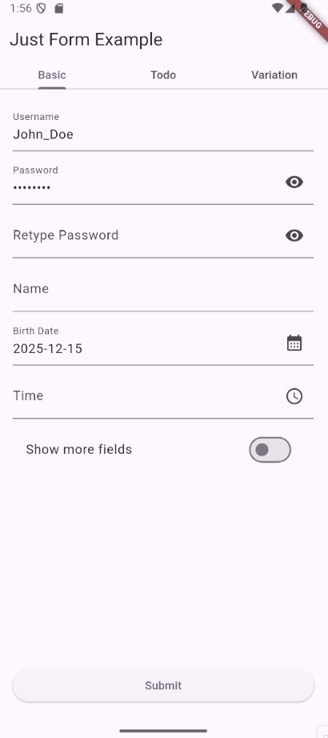
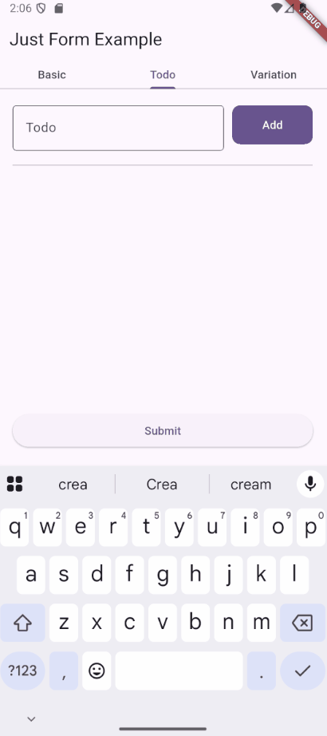

# Just Form

# This README are UNDER CONSTRUCTION
Example code may be not work. i'm in rush generate it with AI couse my team need to use it asap. will be back soon

A powerful and flexible Flutter form management package that provides automatic field registration, validation, state management using BLoC pattern, and built-in field widgets.

## Table of Contents

- [Just Form](#just-form)
- [This README are UNDER CONSTRUCTION](#this-readme-are-under-construction)
  - [Table of Contents](#table-of-contents)
  - [ScreenShots](#screenshots)
  - [Features](#features)
  - [Getting Started](#getting-started)
    - [Installation](#installation)
    - [Basic Usage](#basic-usage)
  - [Validation](#validation)
    - [Built-in Validators](#built-in-validators)
    - [Cross-Field Validation](#cross-field-validation)
    - [Custom Validation in `JustFormBuilder`](#custom-validation-in-justformbuilder)
      - [When to Use](#when-to-use)
    - [Key Difference](#key-difference)
  - [Form Fields](#form-fields)
    - [Creating Custom Fields](#creating-custom-fields)
  - [Advanced Features](#advanced-features)
    - [Manipulating Attributes](#manipulating-attributes)
    - [Form Control](#form-control)
    - [Selective Rebuilds](#selective-rebuilds)
  - [Examples](#examples)
  - [API Reference](#api-reference)
    - [JustFormBuilder](#justformbuilder)
    - [JustField](#justfield)
    - [JustBuilder](#justbuilder)
    - [JustFormController - Quick Reference](#justformcontroller---quick-reference)
    - [Quick Access](#quick-access)
    - [Common Tasks](#common-tasks)
    - [JustFieldController](#justfieldcontroller)
  - [License](#license)
  - [Contributing](#contributing)
  - [Support](#support)


---

## ScreenShots
| Basic Usage | Todo |
|----------|-----|
|  |  |

## Features

✅ Automatic form field registration and lifecycle management  
✅ Real-time field value and error tracking  
✅ Cross-field validation support  
✅ Custom field widget creation  
✅ Flexible rebuild triggers (value, error, attributes)  
✅ Field attribute manipulation   
✅ Built-in field widgets (TextField, DateField, DropdownField, etc.)  
✅ Selective field rebuilding with `JustBuilder`  

---

## Getting Started

### Installation

Add `just_form` to your `pubspec.yaml`:

```yaml
dependencies:
  just_form: ^0.0.1
```

### Basic Usage

The simplest form requires just a `JustFormBuilder` and some fields:

```dart
import 'package:flutter/material.dart';
import 'package:just_form/just_form_builder.dart';
import 'package:just_form/field/just_text_field.dart';

class MyForm extends StatelessWidget {
  @override
  Widget build(BuildContext context) {
    return JustFormBuilder(
      builder: (context) {
        return Column(
          children: [
            // Email field
            JustTextField(
              name: 'email',
              decoration: InputDecoration(
                hintText: 'Enter email',
                labelText: "Email"
              ),
            ),
            
            // Password field
            JustTextField(
              name: 'password',
              decoration: InputDecoration(
                hintText: 'Enter password',
                labelText: "Password"
              ),
            ),
            
            // Submit button
            ElevatedButton(
              onPressed: () {
                final formController = context.justForm;
                formController.validate();
                print('Form values: ${formController.getValues()}');
                print('Form errors: ${formController.getErrors()}');
              },
              child: Text('Submit'),
            ),
          ],
        );
      },
    );
  }
}
```

---

## Validation

### Built-in Validators

Just Form supports any `FormFieldValidator<T>` from Flutter. Use packages like `validatorless` or create your own:

```dart
JustTextField(
  name: 'email',
  validators: [
    (value) {
      if (value == null || value.isEmpty) {
        return 'Email is required';
      }
      if (!value.contains('@')) {
        return 'Please enter a valid email';
      }
      return null;
    },
  ],
  builder: (context, controller) {
    return TextField(
      onChanged: (value) => controller.value = value,
      decoration: InputDecoration(errorText: controller.error),
    );
  },
)
```

### Cross-Field Validation

Validate multiple fields together using `JustValidator`:

```dart
JustFormBuilder(
  validators: [
    JustValidator(
      triggers: ['password', 're-password'],
      validator: (formValues) {
        if (formValues?["password"] != formValues?["re-password"]) {
            return "not_match";
        }
        return null;        
      },
      targets: [
        JustTargetError(
          field: 're-password',
          message: (error) => 'Passwords do not match',
        ),
      ],
    ),
  ],
  builder: (context) {
    return Column(
      children: [
        JustTextField(
          name: 'password',
          decoration: InputDecoration(
            hintText: 'Enter password',
            labelText: "Password"
          ),
        ),
        JustTextField(
          name: 're-password',
          decoration: InputDecoration(
            hintText: 'Retype Enter password',
            labelText: "Retype Password"
          ),
        ),
      ],
    );
  },
)
```

### Custom Validation in `JustFormBuilder`

Unlike **field-level** or **form-level** validators, the package doesn’t ship with built‑in support for custom/async validation. But you can still hook into the **form API** directly to set errors programmatically.

You can access the form context and manually set an error on any field:

```dart
context.justForm.field("username")?.setError("Username already taken");
```

- **`context.justForm`** → gives you access to the form instance.  
- **`.field("fieldName")`** → retrieves the field controller by name.  
- **`.setError("message")`** → attaches a custom error message to that field.

#### When to Use
This pattern is useful for validations that:
- Require **async checks** (e.g., API calls to check if a username/email is already registered).
- Depend on **external state** (e.g., server-side rules, business logic).
- Take longer than synchronous validation (e.g., debounce + network request).


### Key Difference
- **Default validation** → tied to the field (`validator:` inside `JustTextField`).  
- **Cross validation** → tied to the form (`JustValidator` inside `JustFormBuilder`).  
- **Custom validation** → not provided by the package, but you can **manually set errors** via `context.justForm.field(...).setError(...)`.

---

## Form Fields

### Creating Custom Fields

Create your own field widgets by extending `JustField<T>`:

```dart
class MyCustomField extends StatelessWidget {
  final String name;
  final String? initialValue;
  final void Function(String?)? onChanged;

  const MyCustomField({
    required this.name,
    this.initialValue,
    this.onChanged,
  });

  @override
  Widget build(BuildContext context) {
    return JustField<String>(
      name: name,
      initialValue: initialValue,
      builder: (context, controller) {
        return Container(
          padding: EdgeInsets.all(8),
          decoration: BoxDecoration(
            border: Border.all(color: Colors.grey),
            borderRadius: BorderRadius.circular(8),
          ),
          child: Column(
            crossAxisAlignment: CrossAxisAlignment.start,
            children: [
              TextField(
                onChanged: (value) {
                  controller.value = value;
                  onChanged?.call(value);
                },
                decoration: InputDecoration(
                  hintText: 'Enter value',
                  border: InputBorder.none,
                  errorText: controller.error,
                ),
              ),
            ],
          ),
        );
      },
    );
  }
}

// Usage
MyCustomField(
  name: 'custom-field',
  initialValue: 'Hello',
  onChanged: (value) => print('Changed: $value'),
)
```

---

## Advanced Features

### Manipulating Attributes

Attributes are custom metadata you can attach to fields:

```dart
JustTextField(
  name: 'email',
  initialAttributes: {
    'touched': false,
    'validating': false,
    'lastValidated': null,
  },
  builder: (context, controller) {
    return TextField(
      onChanged: (value) {
        controller.value = value;
        // Mark field as touched
        controller.setAttribute('touched', true);
      },
      onFocus: (hasFocus) {
        if (hasFocus) {
          controller.setAttribute('validating', true);
        }
      },
      decoration: InputDecoration(
        hintText: 'Enter email',
        errorText: controller.error,
        filled: controller.attributes['touched'] == true,
        fillColor: Colors.blue.withOpacity(0.1),
      ),
    );
  },
)
```

**Access attributes in JustBuilder:**

```dart
JustBuilder(
  fields: ['email'],
  rebuildOnAttributeChanged: true,
  builder: (context, state) {
    final email = state['email'];
    final touched = email?.attributes['touched'] ?? false;
    
    return Column(
      children: [
        if (touched) Text('Field was touched'),
        if (email?.attributes['validating'] == true)
          CircularProgressIndicator(),
      ],
    );
  },
)
```

### Form Control

Access and manipulate the entire form:

```dart
ElevatedButton(
  onPressed: () {
    final formController = context.read<JustFormController>();
    
    // Get all values
    print('Values: ${formController.values}');
    
    // Get all errors
    print('Errors: ${formController.errors}');
    
    // Validate the form
    final isValid = await formController.validate();
    
    // Set field value
    formController.fields()['email']?.value = 'new@email.com';
    
    // Reset form
    formController.reset();
    
    // Get specific field
    final emailField = formController.fields()['email'];
    print('Email value: ${emailField?.value}');
  },
  child: Text('Check Form'),
)
```

### Selective Rebuilds

Use `JustBuilder` to rebuild only when specific fields change:

```dart
JustBuilder(
  fields: ['email', 'password'],
  rebuildOnValueChanged: true,
  rebuildOnErrorChanged: true,
  builder: (context, state) {
    final email = state['email'];
    final password = state['password'];
    
    return Column(
      children: [
        if (email?.error != null)
          Text('Email error: ${email?.error}'),
        if (password?.error != null)
          Text('Password error: ${password?.error}'),
        // Rebuild only when email or password changes
      ],
    );
  },
)
```

---

## Examples

Check the `/example` folder for complete working examples:

- **basic_example.dart** - Complete form with various field types
- **basic_example_nested_form.dart** - Nested forms and complex structures
- **todo.dart** - Dynamic list of fields example

To run the example:

```bash
cd example
flutter run
```

---

## API Reference

### JustFormBuilder

The main widget for building forms.

**Properties:**
- `builder` - Required. Widget builder function
- `controller` - Optional. External form controller
- `initialValues` - Map of initial field values
- `validators` - List of form-level validators
- `onFieldRegistered` - Callback when field registers
- `onValuesChanged` - Callback when any field value changes
- `onErrorsChanged` - Callback when errors change

### JustField<T>

Generic field widget for managing individual form fields.

**Properties:**
- `name` - Required. Unique field identifier
- `builder` - Required. Field widget builder
- `initialValue` - Initial field value
- `validators` - Field-level validators
- `keepValueOnDestroy` - Preserve value on widget removal
- `rebuildOnValueChanged` - Rebuild on value changes
- `rebuildOnErrorChanged` - Rebuild on error changes
- `rebuildOnAttributeChanged` - Rebuild on attribute changes
- `initialAttributes` - Custom metadata

### JustBuilder

Selective field listener and rebuilder.

**Properties:**
- `fields` - List of field names to monitor
- `allFields` - Monitor all fields
- `builder` - Required. Widget builder function
- `rebuildOnValueChanged` - Rebuild on value changes
- `rebuildOnErrorChanged` - Rebuild on error changes
- `rebuildOnAttributeChanged` - Rebuild on attribute changes

### JustFormController - Quick Reference

| Method/Property | Purpose | Returns | Example |
|---|---|---|---|
| `getValues()` | Get all form field values | `Map<String, dynamic>` | `context.justForm.getValues()['email']` |
| `getErrors()` | Get all validation errors (only non-null) | `Map<String, String?>` | `context.justForm.getErrors()['email']` |
| `isValid()` | Check if form has no errors | `bool` | `if (context.justForm.isValid()) { ... }` |
| `validate()` | Trigger validation on all fields | `void` | `context.justForm.validate()` |
| `patchValues(values)` | Update multiple field values at once | `void` | `context.justForm.patchValues({'email': 'new@email.com'})` |
| `field<T>(name)` | Get a specific field controller | `JustFieldController<T>?` | `context.justForm.field('email')?.value = 'x@y.com'` |
| `fields()` | Get all field controllers as a map | `Map<String, JustFieldController>` | `context.justForm.fields()['email']?.value` |
| `addValuesChangedListener(fn)` | Listen to value changes | `void` | `context.justForm.addValuesChangedListener((values) { ... })` |
| `addErrorsChangedListener(fn)` | Listen to error changes | `void` | `context.justForm.addErrorsChangedListener((errors) { ... })` |
| `dispose()` | Clean up resources | `void` | `context.justForm.dispose()` |
<!-- | `reset()` | Reset form to initial state | `void` | `context.justForm.reset()` | -->

### Quick Access

| Way to Access Controller | Code |
|---|---|
| Inside widget | `final controller = context.justForm;` |
| With read | `final controller = context.read<JustFormController>();` |
| With watch (rebuilds) | `final controller = context.watch<JustFormController>();` |

### Common Tasks

| Task | Code |
|---|---|
| Get form data to submit | `final data = controller.getValues();` |
| Check if valid before submit | `if (controller.isValid()) { submitForm(); }` |
| Show all errors | `controller.validate();` |
| Update a field | `controller.field('email')?.value = 'new@email.com';` |
| Set field error manually | `controller.field('email')?.setError('Custom error');` |
| Get specific field value | `final email = controller.field('email')?.value;` |
| Listen to changes | `controller.addValuesChangedListener((values) { print(values); });` |
<!-- | Clear form | `controller.reset();` | -->

### JustFieldController<T>

Controller for individual field management.

**Properties:**
- `value` - Get/set field value
- `error` - Get/set field error
- `attributes` - Get field attributes

**Methods:**
- `setValue(T value)` - Set field value
- `setError(String? error)` - Set field error
- `setAttribute(String key, dynamic value)` - Set attribute
- `getState()` - Get current field state

---

## License

This package is licensed under the MIT License. See LICENSE file for details.

---

## Contributing

Contributions are welcome! Please feel free to submit a Pull Request.

---

## Support

For issues, questions, or suggestions, please open an issue on the GitHub repository.
