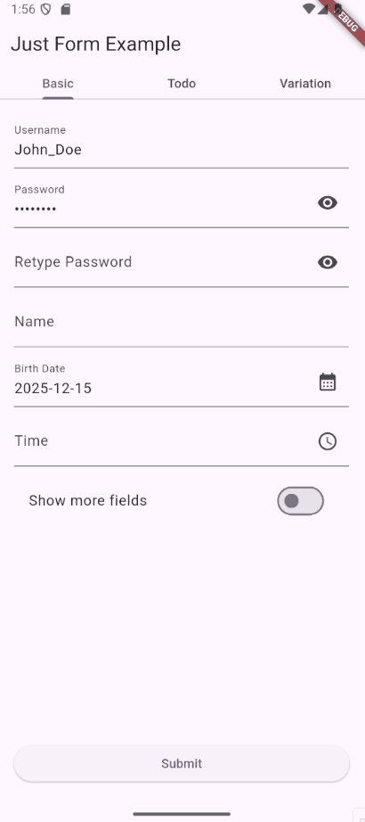
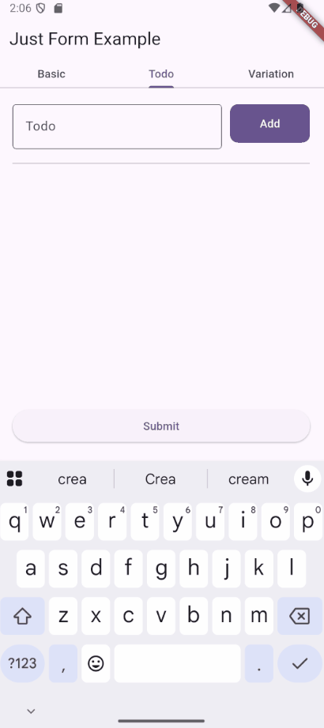

# Just Form

[](https://pub.dev/packages/just_form)  [](https://saweria.co/hrlns) [](https://ko-fi.com/M4M81N5IYI)

A powerful and flexible Flutter form management package that saves you hours of boilerplate. Get automatic field registration, smart validation (field-level, form-level, and async), built-in state management with pre-built fields, reactive UIs without setState using JustBuilder, and easy custom field support. Build production-ready forms in minutes.

[](https://ko-fi.com/M4M81N5IYI)

## Why Just Form?

**Stop wrestling with form management.** Just Form handles the boring stuff so you can focus on building great UIs:

- 📝 **Build forms in minutes** – Add fields, validation works automatically
- ✨ **Smart initial values** – Set defaults at multiple levels, highest priority wins
- 🎯 **Powerful validation** – Combine field validation, form-level checks, and async validation
- 🎨 **Reactive UIs without setState** – Use JustBuilder to update specific parts when fields change
- 🔧 **Pre-built fields** – Multiple ready-to-use form fields (text, dropdown, date, checkbox, etc.)
- 🛠️ **Easy customization** – Wrap any widget as a form field with just a few lines
- 💾 **Smart state management** – Store custom data on fields, react to any change
- ⚡ **High performance** – Only rebuild what changed, skip unnecessary updates

## Table of Contents

- [Just Form](#just-form)
  - [Why Just Form?](#why-just-form)
  - [Table of Contents](#table-of-contents)
  - [ScreenShots](#screenshots)
  - [Features](#features)
  - [Basic Usage](#basic-usage)
    - [1. Wrap your form with JustFormBuilder](#1-wrap-your-form-with-justformbuilder)
    - [2. Add form fields](#2-add-form-fields)
    - [3. Validate and get form values](#3-validate-and-get-form-values)
  - [Validation](#validation)
    - [1. Field-Level Validation](#1-field-level-validation)
    - [2. Form-Level Validation](#2-form-level-validation)
    - [3. Custom/Async Validation](#3-customasync-validation)
  - [Initial Values](#initial-values)
    - [Priority (Highest to Lowest):](#priority-highest-to-lowest)
    - [How it Works:](#how-it-works)
    - [Example:](#example)
  - [Predefined Fields](#predefined-fields)
    - [Text Input Fields](#text-input-fields)
      - [JustTextField](#justtextfield)
      - [JustPickerField](#justpickerfield)
    - [Selection Fields](#selection-fields)
      - [JustDropdownButton](#justdropdownbutton)
      - [JustRadioGroup](#justradiogroup)
    - [Boolean Fields](#boolean-fields)
      - [JustCheckbox](#justcheckbox)
      - [JustCheckboxListTile](#justcheckboxlisttile)
      - [JustSwitch](#justswitch)
      - [JustSwitchListTile](#justswitchlisttile)
    - [Date \& Time Fields](#date--time-fields)
      - [JustDateField](#justdatefield)
      - [JustTimeField](#justtimefield)
    - [Slider Fields](#slider-fields)
      - [JustSlider](#justslider)
      - [JustRangeSlider](#justrangeslider)
    - [Special Fields](#special-fields)
      - [JustFieldList](#justfieldlist)
      - [JustNestedBuilder](#justnestedbuilder)
    - [Field Comparison Table](#field-comparison-table)
  - [Form Controller](#form-controller)
    - [Accessing the Controller](#accessing-the-controller)
      - [Option 1: Use context.justForm (Recommended)](#option-1-use-contextjustform-recommended)
      - [Option 2: Declare Controller Explicitly](#option-2-declare-controller-explicitly)
    - [Common Operations](#common-operations)
      - [1. **Validate the Form**](#1-validate-the-form)
      - [2. **Check if Form is Valid**](#2-check-if-form-is-valid)
      - [3. **Get All Form Values**](#3-get-all-form-values)
      - [4. **Get All Form Errors**](#4-get-all-form-errors)
      - [5. **Access Individual Field**](#5-access-individual-field)
      - [6. **Get All Fields**](#6-get-all-fields)
      - [7. **Patch Multiple Values at Once**](#7-patch-multiple-values-at-once)
      - [8. **Listen to Value Changes**](#8-listen-to-value-changes)
      - [9. **Listen to Error Changes**](#9-listen-to-error-changes)
  - [Field Controller](#field-controller)
    - [Accessing a Field Controller](#accessing-a-field-controller)
    - [Field Controller Capabilities](#field-controller-capabilities)
      - [1. **Get Field Value**](#1-get-field-value)
      - [2. **Set Field Value**](#2-set-field-value)
      - [3. **Get Field Error**](#3-get-field-error)
      - [4. **Set Custom Error**](#4-set-custom-error)
      - [5. **Get Field State**](#5-get-field-state)
      - [6. **Field Attributes**](#6-field-attributes)
      - [7. **Mark Field as Touched**](#7-mark-field-as-touched)
      - [8. **Listen to Field Changes**](#8-listen-to-field-changes)
      - [9. **Set Value and Attributes Together**](#9-set-value-and-attributes-together)
  - [JustBuilder](#justbuilder)
    - [When to Use JustBuilder](#when-to-use-justbuilder)
    - [Basic Usage](#basic-usage-1)
      - [Monitor Specific Fields](#monitor-specific-fields)
      - [Monitor All Fields](#monitor-all-fields)
    - [Rebuild Conditions](#rebuild-conditions)
    - [Advanced Example: Dynamic Field Display](#advanced-example-dynamic-field-display)
    - [Example: Loading Indicator with Async Validation](#example-loading-indicator-with-async-validation)
  - [Building Custom Fields with JustField](#building-custom-fields-with-justfield)
    - [What JustField Does For You](#what-justfield-does-for-you)
    - [Creating a Simple Custom Field](#creating-a-simple-custom-field)
    - [JustField Capabilities](#justfield-capabilities)
      - [1. **Generic Type Support**](#1-generic-type-support)
      - [2. **Flexible Rebuild Conditions**](#2-flexible-rebuild-conditions)
      - [3. **Lifecycle Callbacks**](#3-lifecycle-callbacks)
      - [4. **Value Persistence**](#4-value-persistence)
      - [5. **Field Attributes for Custom State**](#5-field-attributes-for-custom-state)

---

## ScreenShots

| Basic Usage | Todo |
|----------|-----|
|  |  |

---

## Features

- ✅ Automatic field registration and management
- ✅ Field-level, form-level, and async validation
- ✅ 3-tier initial values priority system
- ✅ Easy value access with `getValues()`
- ✅ Form and field state management with controllers
- ✅ Reactive UI with JustBuilder (no setState needed)
| Basic Usage | Todo |
|----------|-----|
|  |  |

---

## Basic Usage

### 1. Wrap your form with JustFormBuilder

```dart
JustFormBuilder(
  initialValues: {
    "username": "John_Doe",
    "birth-date": DateTime.now(),
  },
  validators: [
    JustValidator(
      triggers: ["password", "re-password"],
      validator: (value) {
        if (value?["password"] != value?["re-password"]) {
          return "not_match";
        }
        return null;
      },
      targets: [
        JustTargetError(
          field: "re-password",
          message: (error) => "The password doesn't match",
        ),
      ],
    ),
  ],
  builder: (context) {
    // Your form fields here
    return Column(children: [
      // Form fields
    ]);
  },
)
```

### 2. Add form fields

Use built-in Just Form field widgets:

```dart
JustTextField(
  name: "username",
  decoration: InputDecoration(labelText: "Username"),
  validators: [
    Validatorless.required("Field is required"),
    Validatorless.min(6, 'Min length 6'),
    Validatorless.max(20, 'Max length 20'),
  ],
),
JustTextField(
  name: "password",
  obscureText: true,
  decoration: InputDecoration(labelText: "Password"),
  validators: [
    Validatorless.required("Field is required"),
    Validatorless.min(6, 'Min length 6'),
  ],
),
JustDateField(
  name: "birth-date",
  firstDate: DateTime(1800),
  lastDate: DateTime.now(),
  decoration: InputDecoration(labelText: "Birth Date"),
),
JustCheckbox(
  name: "agree",
  initialValue: false,
),
JustSwitchListTile(
  name: "notifications",
  title: Text("Enable Notifications"),
),
```

### 3. Validate and get form values

```dart
ElevatedButton(
  onPressed: () {
    var formController = context.justForm;
    formController.validate();
    
    if (formController.isValid()) {
      var formData = formController.getValues();
      print(formData); // Use the form data
    } else {
      var errors = formController.getErrors();
      print(errors); // Handle validation errors
    }
  },
  child: Text("Submit"),
)
```

---

## Validation

Just Form supports three types of validation:

### 1. Field-Level Validation

Validate individual fields using the `validators` parameter. Field validators only check their own value:

```dart
JustTextField(
  name: "username",
  decoration: InputDecoration(labelText: "Username"),
  validators: [
    Validatorless.required("Field is required"),
    Validatorless.min(6, 'Min length 6'),
    Validatorless.max(20, 'Max length 20'),
  ],
),
JustTextField(
  name: "email",
  decoration: InputDecoration(labelText: "Email"),
  validators: [
    Validatorless.required("Field is required"),
    Validatorless.email("Invalid email"),
  ],
),
```

### 2. Form-Level Validation

Validate across multiple fields using `JustValidator` in the `JustFormBuilder`. This allows you to combine multiple field values and target errors to specific fields:

```dart
JustFormBuilder(
  validators: [
    JustValidator(
      triggers: ["password", "re-password"],  // Fields that trigger this validator
      validator: (value) {
        if (value?["password"] != value?["re-password"]) {
          return "not_match";
        }
        return null;
      },
      targets: [
        JustTargetError(
          field: "re-password",  // Target field to show the error
          message: (error) => "The password doesn't match",
        ),
      ],
    ),
  ],
  builder: (context) {
    // Form fields
  },
)
```

**How it works:**
- `triggers`: List of field names that trigger this validator when they change
- `validator`: Function that receives all form values and returns an error or null
- `targets`: List of fields where errors should be displayed (supports multiple fields)

### 3. Custom/Async Validation

Set custom errors programmatically using the `setError()` function. This is useful for async validation like checking if an email already exists:

```dart
ElevatedButton(
  onPressed: () async {
    var emailField = context.justForm.field('email');
    
    // Show loading state
    emailField.setError("Checking...");
    
    // Simulate async validation
    await Future.delayed(Duration(seconds: 2));
    
    // Check if email exists (example)
    bool emailExists = await checkEmailExists(emailField.getValue());
    
    if (emailExists) {
      emailField.setError("Email already exists");
    } else {
      emailField.setError(null); // Clear error
    }
  },
  child: Text("Check Email"),
)
```

**Getting form data with validation:**

```dart
var formController = context.justForm;
formController.validate();

if (formController.isValid()) {
  var formData = formController.getValues();
  print(formData); // Process valid form data
} else {
  var errors = formController.getErrors();
  print(errors); // Handle validation errors
}
```

---

## Initial Values

Just Form supports setting initial values at three levels with a clear priority order:

### Priority (Highest to Lowest):
1. **Controller Level** (Highest) - `JustFormController.initialValues`
2. **Form Level** - `JustFormBuilder.initialValues` (only used if controller has no initialValues)
3. **Field Level** (Lowest) - Individual field's `initialValue` parameter

### How it Works:

- If the **controller** has `initialValues` set, it completely **replaces** the form's initialValues
- For each field without an initial value in the controller, the **form initial value** is used
- If neither controller nor form have an initial value, the **field initial value** is used
- If none are specified, the field defaults to null

### Example:

```dart
// 1. Controller Level (Strongest) - Replaces form initialValues entirely
var controller = JustFormController(
  initialValues: {
    "username": "admin",
    "email": "admin@example.com",
  },
);

// 2. Form Level (Medium) - Only used if controller has no initialValues
JustFormBuilder(
  initialValues: { // Completely ignored because controller has initialValues
    "username": "user",  
    "phone": "+1234567890",
  },
  builder: (context) {
    return Column(
      children: [
        // 3. Field Level (Lowest)
        JustTextField(
          name: "username",
          initialValue: "guest",  // Ignored - controller takes precedence
        ),
        JustTextField(
          name: "phone",
          initialValue: "+0000000000",  // Used - no controller value
        ),
        JustTextField(
          name: "address",
          initialValue: "123 Main St",  // Used - no controller value
        ),
      ],
    );
  },
)
```

**Result:**
- `username`: `"admin"` (from controller)
- `email`: `"admin@example.com"` (from controller)
- `phone`: `"+0000000000"` (from field)
- `address`: `"123 Main St"` (from field)

---

## Predefined Fields

Just Form comes with a complete set of built-in field widgets ready to use. Each field is fully integrated with the form system and supports validation, initial values, and custom attributes.

### Text Input Fields

#### JustTextField
Text input field with validation and keyboard support.

```dart
JustTextField(
  name: 'email',
  decoration: InputDecoration(labelText: 'Email'),
  keyboardType: TextInputType.emailAddress,
  validators: [Validatorless.email('Invalid email')],
)
```

**Features:** Multi-line support, input formatting, character counter, custom styling

#### JustPickerField
Generic picker field for custom selection logic.

```dart
JustPickerField<String>(
  name: 'color',
  onPick: () async {
    // Custom picker logic
    return 'selected_value';
  },
  builder: (value) => Text(value ?? 'Pick color'),
)
```

### Selection Fields

#### JustDropdownButton
Dropdown/select field for choosing from predefined options.

```dart
JustDropdownButton<String>(
  name: 'country',
  items: ['USA', 'Canada', 'Mexico'],
  hint: 'Select a country',
)
```

**Features:** Custom item builders, search, grouped items

#### JustRadioGroup
Radio button group for single selection.

```dart
JustRadioGroup<String>(
  name: 'gender',
  options: ['Male', 'Female', 'Other'],
)
```

### Boolean Fields

#### JustCheckbox
Boolean checkbox field with tristate support.

```dart
JustCheckbox(
  name: 'agree',
  tristate: false,
)
```

**Features:** Tristate support, custom colors, enabled/disabled state

#### JustCheckboxListTile
Checkbox with label and subtitle.

```dart
JustCheckboxListTile(
  name: 'newsletter',
  title: Text('Subscribe to newsletter'),
  subtitle: Text('Receive weekly updates'),
)
```

#### JustSwitch
Toggle switch field.

```dart
JustSwitch(
  name: 'notifications',
)
```

**Features:** Custom colors, enabled/disabled state

#### JustSwitchListTile
Switch with label and subtitle.

```dart
JustSwitchListTile(
  name: 'darkMode',
  title: Text('Dark Mode'),
  subtitle: Text('Enable dark theme'),
)
```

### Date & Time Fields

#### JustDateField
Date picker field.

```dart
JustDateField(
  name: 'birthDate',
  firstDate: DateTime(1900),
  lastDate: DateTime.now(),
  dateFormatText: 'yyyy-MM-dd',
)
```

**Features:** Custom date format, free text input, first/last date constraints

#### JustTimeField
Time picker field.

```dart
JustTimeField(
  name: 'startTime',
  freeText: true,
)
```

**Features:** 12/24 hour format, free text input

### Slider Fields

#### JustSlider
Numeric slider for single value selection.

```dart
JustSlider<double>(
  name: 'volume',
  min: 0,
  max: 100,
  divisions: 10,
)
```

**Features:** Custom min/max, divisions, labels

#### JustRangeSlider
Range slider for selecting min/max values.

```dart
JustRangeSlider<RangeValues>(
  name: 'priceRange',
  min: 0,
  max: 1000,
  divisions: 10,
)
```

### Special Fields

#### JustFieldList
Dynamic list field for arrays of values.

```dart
JustFieldList<String>(
  name: 'hobbies',
  initialValue: [],
)
```

**Features:** Add/remove items, custom item builder

#### JustNestedBuilder
Nested form field for complex objects.

```dart
JustNestedBuilder(
  name: 'address',
  builder: (context, parentForm) {
    return Column(
      children: [
        JustTextField(name: 'street'),
        JustTextField(name: 'city'),
      ],
    );
  },
)
```

### Field Comparison Table

| Field | Type | Use Case |
|-------|------|----------|
| `JustTextField` | `String` | Text input, emails, URLs |
| `JustDropdownButton` | Generic | Single selection from list |
| `JustRadioGroup` | Generic | Single selection with radio buttons |
| `JustCheckbox` | `bool` | Boolean toggle |
| `JustCheckboxListTile` | `bool` | Boolean toggle with label |
| `JustSwitch` | `bool` | Boolean switch |
| `JustSwitchListTile` | `bool` | Boolean switch with label |
| `JustDateField` | `DateTime` | Date selection |
| `JustTimeField` | `TimeOfDay` | Time selection |
| `JustSlider` | `double/int` | Single numeric value |
| `JustRangeSlider` | `RangeValues` | Min/max numeric range |
| `JustFieldList` | `List<T>` | Dynamic lists |
| `JustPickerField` | Generic | Custom picker |
| `JustNestedBuilder` | `Map<String, dynamic>` | Nested forms |

---
## Form Controller

The `JustFormController` is the core of Just Form. It manages the entire form state including field values, errors, and validation. 

**You have two options:**
1. **Optional: Declare it explicitly** - Pass a custom controller via the `controller` parameter in `JustFormBuilder`
2. **Automatic (Recommended)** - Let `JustFormBuilder` create one automatically and access it via `context.justForm` without any setup

### Accessing the Controller

#### Option 1: Use context.justForm (Recommended)

The simplest approach - the controller is automatically available in any widget inside `JustFormBuilder` using the `context.justForm` extension:

```dart
JustFormBuilder(
  builder: (context) {
    // Access controller automatically - no declaration needed!
    var formController = context.justForm;
    
    return Column(
      children: [
        JustTextField(name: "email"),
        ElevatedButton(
          onPressed: () {
            formController.validate();
            if (formController.isValid()) {
              print(formController.getValues());
            }
          },
          child: Text("Submit"),
        ),
      ],
    );
  },
)
```

#### Option 2: Declare Controller Explicitly

If you need to access the controller outside `JustFormBuilder` or manage it manually, you can create and pass it:

```dart
class MyFormPage extends StatefulWidget {
  @override
  State<MyFormPage> createState() => _MyFormPageState();
}

class _MyFormPageState extends State<MyFormPage> {
  late JustFormController formController;
  
  @override
  void initState() {
    super.initState();
    formController = JustFormController(
      initialValues: {
        'username': '',
        'email': '',
      },
    );
  }
  
  @override
  void dispose() {
    formController.dispose();
    super.dispose();
  }
  
  @override
  Widget build(BuildContext context) {
    return JustFormBuilder(
      controller: formController,  // Pass the controller
      builder: (context) {
        return Column(
          children: [
            JustTextField(name: "email"),
            ElevatedButton(
              onPressed: () {
                formController.validate();
                if (formController.isValid()) {
                  print(formController.getValues());
                }
              },
              child: Text("Submit"),
            ),
          ],
        );
      },
    );
  }
}
```

**When to use explicit controller:**
- Need to access form outside of `JustFormBuilder`
- Managing multiple forms
- Need fine-grained control over controller lifecycle
- Want to pre-populate form with data from previous states

### Common Operations

#### 1. **Validate the Form**

```dart
var formController = context.justForm;
formController.validate();  // Run all validators
```

#### 2. **Check if Form is Valid**

```dart
if (formController.isValid()) {
  print("Form is valid!");
} else {
  print("Form has errors");
}
```

#### 3. **Get All Form Values**

```dart
var formData = formController.getValues();
print(formData);  // Map<String, dynamic>
// {"username": "john", "email": "john@example.com", ...}

// Include hidden fields (inactive fields)
var allData = formController.getValues(withHiddenFields: true);
```

#### 4. **Get All Form Errors**

```dart
var errors = formController.getErrors();
print(errors);  // Map<String, String>
// {"email": "Invalid email format", ...}

// Include errors from hidden fields
var allErrors = formController.getErrors(withHiddenFields: true);
```

#### 5. **Access Individual Field**

```dart
var emailField = formController.field('email');

// Get field value
var value = emailField.getValue();

// Set field value
emailField.setValue('new@example.com');

// Get field error
var error = emailField.getError();

// Set custom error (useful for async validation)
emailField.setError('Email already exists');

// Clear error
emailField.setError(null);
```

#### 6. **Get All Fields**

```dart
var allFields = formController.fields();
// Returns: Map<String, JustFieldController>
```

#### 7. **Patch Multiple Values at Once**

```dart
formController.patchValues({
  'username': 'newuser',
  'email': 'new@example.com',
  'phone': '+1234567890',
});
```

#### 8. **Listen to Value Changes**

```dart
var formController = context.justForm;

formController.addValuesChangedListener((values) {
  print('Form values changed: $values');
});

// Don't forget to remove listener when done
formController.removeValuesChangedListener(onValuesChanged);
```

#### 9. **Listen to Error Changes**

```dart
formController.addErrorsChangedListener((errors) {
  print('Form errors changed: $errors');
});
```

---

## Field Controller

Each field in the form has its own `JustFieldController` that manages individual field state. You can access a specific field controller using the `field()` function from the form controller.

### Accessing a Field Controller

```dart
var formController = context.justForm;

// Get a specific field controller (with type safety)
JustFieldController<String>? emailField = formController.field('email');

// Get all field controllers
Map<String, JustFieldController> allFields = formController.fields();
```

### Field Controller Capabilities

#### 1. **Get Field Value**

```dart
var emailField = formController.field('email');
var value = emailField.getValue();
// or use getter
var value = emailField.value;
```

#### 2. **Set Field Value**

```dart
emailField.setValue('new@example.com');
// or use setter
emailField.value = 'new@example.com';
```

#### 3. **Get Field Error**

```dart
var error = emailField.getError();
// or use getter
var error = emailField.error;
```

#### 4. **Set Custom Error**

Useful for async validation like checking email availability:

```dart
// Set error
emailField.setError('Email already exists');

// Clear error
emailField.setError(null);
// or use setter
emailField.error = null;
```

#### 5. **Get Field State**

Get complete field state including value, error, touched status, etc.:

```dart
var state = emailField.getState();
print(state.value);       // Current value
print(state.error);       // Current error
print(state.name);        // Field name
print(state.active);      // Is field active
print(state.updateTime);  // Last update time
```

#### 6. **Field Attributes**

Attributes allow you to dynamically override field parameters at runtime. Each field widget has predefined attributes (like `decoration`, `enabled`, `obscureText`, etc.) that correspond to its constructor parameters. You can also use attributes for custom purposes.

**Predefined Attributes** (vary by field type):
- `JustTextField`: `decoration`, `enabled`, `keyboardType`, `style`, `obscureText`, `maxLength`, etc.
- `JustCheckbox`: `enabled`, `tristate`, `activeColor`, `checkColor`, etc.
- `JustDateField`: `enabled`, `decoration`, etc.

**Example: Override field parameters dynamically**

```dart
var textField = formController.field('password');

// Override the decoration at runtime
textField.setAttribute('decoration', InputDecoration(
  labelText: 'Password',
  border: OutlineInputBorder(),
));

// Toggle obscureText dynamically
textField.setAttribute('obscureText', false);

// Disable/enable the field
textField.setAttribute('enabled', false);

// Patch multiple attributes at once
textField.patchAttributes({
  'enabled': true,
  'style': TextStyle(fontSize: 16),
});

// Get all attributes
Map<String, dynamic> attrs = textField.getAttributes();

// Get a single attribute
var obscure = textField.getAttribute<bool>('obscureText');
```

**Custom Attributes** (for your own purposes):

You can also use attributes to store custom data or flags for custom logic:

```dart
var emailField = formController.field('email');

// Store custom state
emailField.setAttribute('loading', true);
emailField.setAttribute('validating', false);
emailField.setAttribute('suggestions', ['user@gmail.com', 'user@outlook.com']);

// Use in JustBuilder to react to attribute changes
JustBuilder(
  fields: ['email'],
  rebuildOnAttributeChanged: true,
  builder: (context, state) {
    var isLoading = state['email']?.getAttribute<bool>('loading') ?? false;
    return isLoading ? CircularProgressIndicator() : SizedBox.shrink();
  },
)
```

#### 7. **Mark Field as Touched**

Useful for showing validation errors only on touched fields:

```dart
emailField.touch();
```

#### 8. **Listen to Field Changes**

```dart
emailField.addListener((from, to) {
  print('Field changed from ${from.value} to ${to.value}');
  if (from.error != to.error) {
    print('Error changed: ${to.error}');
  }
});
```

#### 9. **Set Value and Attributes Together**

```dart
emailField.setValueAndPatchAttributes(
  'new@example.com',
  {'loading': false, 'validated': true},
);
```

---

## JustBuilder

`JustBuilder` is a selective widget rebuilder that listens to specific form fields and rebuilds only when monitored fields change. It's designed for performance optimization and creating reactive UI that responds to field changes.

### When to Use JustBuilder

- Display field errors dynamically
- Create dependent fields (e.g., update total when quantity changes)
- Show/hide fields based on other field values
- Display loading indicators for async validations
- Optimize performance by limiting rebuilds to specific fields

### Basic Usage

#### Monitor Specific Fields

```dart
JustBuilder(
  fields: ['email', 'password'],  // Only rebuild when these fields change
  builder: (context, state) {
    var email = state['email'];
    var password = state['password'];
    
    return Column(
      children: [
        if (email?.error != null)
          Text('Email error: ${email?.error}', style: TextStyle(color: Colors.red)),
        if (password?.error != null)
          Text('Password error: ${password?.error}', style: TextStyle(color: Colors.red)),
      ],
    );
  },
)
```

#### Monitor All Fields

```dart
JustBuilder(
  allFields: true,  // Rebuild when ANY field changes
  builder: (context, state) {
    var isFormValid = state.values.every((field) => field.error == null);
    
    return ElevatedButton(
      onPressed: isFormValid ? () {} : null,
      child: Text('Submit'),
    );
  },
)
```

### Rebuild Conditions

Control when the builder rebuilds using these flags:

```dart
JustBuilder(
  fields: ['price', 'quantity'],
  rebuildOnValueChanged: true,       // Rebuild when field values change (default: true)
  rebuildOnErrorChanged: false,      // Rebuild when validation errors change (default: false)
  rebuildOnAttributeChanged: true,   // Rebuild when field attributes change (default: false)
  builder: (context, state) {
    var price = state['price']?.getValue<double>() ?? 0.0;
    var quantity = state['quantity']?.getValue<int>() ?? 0;
    var total = price * quantity;
    
    return Text('Total: \$${total.toStringAsFixed(2)}');
  },
)
```

### Advanced Example: Dynamic Field Display

```dart
JustBuilder(
  fields: ['country', 'state'],
  rebuildOnValueChanged: true,
  builder: (context, state) {
    var country = state['country']?.getValue<String>();
    
    return Column(
      children: [
        JustDropdownButton<String>(
          name: 'country',
          items: ['USA', 'Canada', 'Mexico'],
        ),
        // Only show state field if USA is selected
        if (country == 'USA')
          JustDropdownButton<String>(
            name: 'state',
            items: ['California', 'Texas', 'New York'],
          ),
      ],
    );
  },
)
```

### Example: Loading Indicator with Async Validation

```dart
JustBuilder(
  fields: ['email'],
  rebuildOnAttributeChanged: true,  // Rebuild on custom attribute changes
  builder: (context, state) {
    var email = state['email'];
    var isValidating = email?.getAttribute<bool>('validating') ?? false;
    var error = email?.error;
    
    return Column(
      children: [
        Stack(
          alignment: Alignment.centerRight,
          children: [
            JustTextField(
              name: 'email',
              decoration: InputDecoration(
                labelText: 'Email',
                errorText: error,
              ),
            ),
            if (isValidating)
              Padding(
                padding: EdgeInsets.all(8),
                child: SizedBox(
                  width: 20,
                  height: 20,
                  child: CircularProgressIndicator(strokeWidth: 2),
                ),
              ),
          ],
        ),
        SizedBox(height: 10),
        ElevatedButton(
          onPressed: () async {
            var emailField = context.justForm.field('email');
            var emailValue = emailField.getValue();
            
            // Show loading state
            emailField.setAttribute('validating', true);
            emailField.setError(null);
            
            try {
              // Simulate async email check
              await Future.delayed(Duration(seconds: 2));
              
              bool exists = await checkEmailExists(emailValue);
              
              if (exists) {
                emailField.setError('Email already registered');
              } else {
                emailField.setError(null);
              }
            } finally {
              emailField.setAttribute('validating', false);
            }
          },
          child: Text('Verify Email'),
        ),
      ],
    );
  },
)
```

---

## Building Custom Fields with JustField

`JustField` is a powerful generic widget that makes it easy to create custom form fields. It handles all the form management logic while you focus on building the UI. With JustField, any Flutter widget can become a form field.

### What JustField Does For You

- ✅ Automatic field registration and unregistration
- ✅ Automatic value synchronization with the form controller
- ✅ Validation management and error handling
- ✅ State change tracking (value, error, attributes)
- ✅ Flexible rebuild conditions for performance optimization
- ✅ Support for custom callbacks and listeners
- ✅ Attribute system for storing field metadata

### Creating a Simple Custom Field

Here's a simple custom rating field that uses JustField:

```dart
class CustomRatingField extends StatelessWidget {
  final String name;
  final int? initialValue;
  final List<FormFieldValidator<int>> validators;

  const CustomRatingField({
    required this.name,
    this.initialValue,
    this.validators = const [],
  });

  @override
  Widget build(BuildContext context) {
    return JustField<int>(
      name: name,
      initialValue: initialValue ?? 0,
      validators: validators,
      builder: (context, controller) {
        return Column(
          children: [
            Text('Rating: ${controller.value}'),
            SizedBox(height: 10),
            Row(
              mainAxisAlignment: MainAxisAlignment.center,
              children: List.generate(5, (index) {
                int rating = index + 1;
                bool isSelected = controller.value ?? 0 >= rating;
                
                return GestureDetector(
                  onTap: () => controller.value = rating,
                  child: Icon(
                    Icons.star,
                    color: isSelected ? Colors.amber : Colors.grey,
                    size: 40,
                  ),
                );
              }),
            ),
            if (controller.error != null)
              Padding(
                padding: EdgeInsets.only(top: 8),
                child: Text(
                  controller.error!,
                  style: TextStyle(color: Colors.red),
                ),
              ),
          ],
        );
      },
    );
  }
}
```

**Usage:**

```dart
JustFormBuilder(
  builder: (context) {
    return Column(
      children: [
        CustomRatingField(
          name: 'rating',
          initialValue: 3,
          validators: [
            (value) => value == null || value < 1 ? 'Please select a rating' : null,
          ],
        ),
      ],
    );
  },
)
```

### JustField Capabilities

#### 1. **Generic Type Support**

JustField supports any data type as the field value:

```dart
// String field
JustField<String>(name: 'text', ...)

// Number field
JustField<int>(name: 'count', ...)
JustField<double>(name: 'price', ...)

// Complex types
JustField<List<String>>(name: 'tags', ...)
JustField<DateTime>(name: 'date', ...)
JustField<MyCustomClass>(name: 'custom', ...)
```

#### 2. **Flexible Rebuild Conditions**

Control exactly when the field rebuilds:

```dart
JustField<String>(
  name: 'email',
  rebuildOnValueChanged: true,              // External value changes
  rebuildOnValueChangedInternally: false,   // Internal changes (default)
  rebuildOnAttributeChanged: true,          // Custom attribute changes
  rebuildOnErrorChanged: true,              // Validation error changes
  dontRebuildOnAttributes: ['internal', 'temp'],  // Skip these attributes
  builder: (context, controller) => TextField(),
)
```

#### 3. **Lifecycle Callbacks**

React to field lifecycle events:

```dart
JustField<String>(
  name: 'email',
  onRegistered: (state) {
    print('Field registered with value: ${state.value}');
  },
  onChanged: (value, isInternal) {
    print('Value changed to: $value (internal: $isInternal)');
  },
  onErrorChanged: (error, isInternal) {
    print('Error changed to: $error');
  },
  onAttributeChanged: (attributes, isInternal) {
    print('Attributes changed: $attributes');
  },
  builder: (context, controller) => TextField(),
)
```

#### 4. **Value Persistence**

Control whether field values persist when widgets are destroyed:

```dart
JustField<String>(
  name: 'username',
  keepValueOnDestroy: true,   // Keep value when widget is removed (default)
  builder: (context, controller) => TextField(),
)
```

#### 5. **Field Attributes for Custom State**

Store and access custom metadata:

```dart
JustField<String>(
  name: 'email',
  initialAttributes: {'verified': false, 'checkCount': 0},
  rebuildOnAttributeChanged: true,
  builder: (context, controller) {
    var isVerified = controller.getAttribute<bool>('verified') ?? false;
    var checkCount = controller.getAttribute<int>('checkCount') ?? 0;
    
    return Column(
      children: [
        TextField(
          onChanged: (value) => controller.value = value,
        ),
        Text('Checks: $checkCount'),
        if (isVerified) Text('✓ Verified'),
      ],
    );
  },
)
```

---
